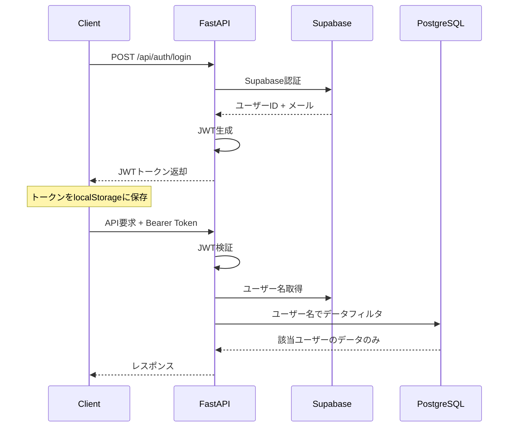
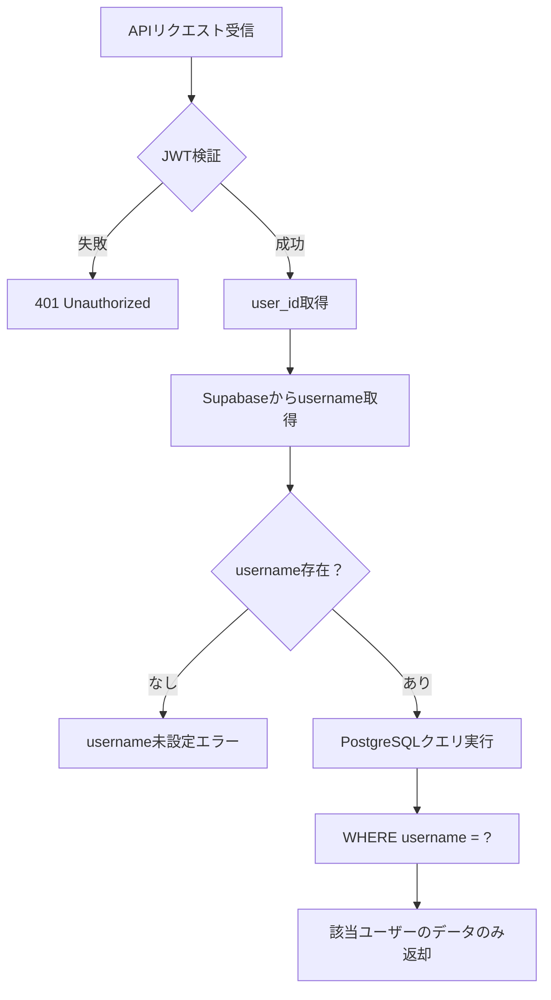

# 認証・セキュリティ仕組み

## 概要

Pathfinder Webは、ユーザーの位置情報データを安全に管理するため、多層防御のセキュリティアーキテクチャを採用しています。

## 認証アーキテクチャ

### 1. 認証フロー



### 2. 認証コンポーネント

| コンポーネント | 役割 | 実装場所 |
|---|---|---|
| **Supabase Auth** | ユーザー認証・管理 | `api/auth.py:23` |
| **JWT トークン** | セッション管理・認証状態維持 | `utils/auth.py` |
| **HTTPBearer** | API認証ミドルウェア | `api/auth.py:15` |
| **get_current_user** | 認証ガード関数 | `api/auth.py:25-30` |

## セキュリティ実装詳細

### 1. JWT (JSON Web Token) セキュリティ

**トークン生成** (`utils/auth.py:14-22`)
```python
def create_access_token(data: dict, expires_delta: Optional[timedelta] = None):
    to_encode = data.copy()
    expire = datetime.utcnow() + timedelta(minutes=ACCESS_TOKEN_EXPIRE_MINUTES)  # 24時間
    to_encode.update({"exp": expire})
    encoded_jwt = jwt.encode(to_encode, SECRET_KEY, algorithm="HS256")
    return encoded_jwt
```

**トークン検証** (`utils/auth.py:24-32`)
```python
def verify_token(token: str):
    try:
        payload = jwt.decode(token, SECRET_KEY, algorithms=["HS256"])
        user_id: str = payload.get("sub")
        if user_id is None:
            return None
        return {"user_id": user_id, "email": payload.get("email")}
    except JWTError:
        return None
```

### 2. フロントエンド認証実装

**自動認証ヘッダー付与** (`static/app.js:48-67`)
```javascript
async makeRequest(url, options = {}) {
    const defaultOptions = {
        headers: {
            'Content-Type': 'application/json',
        }
    };
    
    if (this.token) {
        defaultOptions.headers['Authorization'] = `Bearer ${this.token}`;
    }
    
    const response = await fetch(url, { ...defaultOptions, ...options });
    // エラーハンドリング...
}
```

**トークン検証** (`static/app.js:69-78`)
```javascript
async verifyToken() {
    try {
        await this.makeRequest('/api/auth/verify');
        return true;
    } catch (error) {
        localStorage.removeItem('token');
        this.token = null;
        return false;
    }
}
```

### 3. API保護メカニズム

#### データアクセス保護パターン

すべてのデータAPIは以下のパターンで保護されています：

1. **認証チェック**: `get_current_user` Dependency
2. **ユーザー識別**: JWT payloadからuser_id取得
3. **データフィルタリング**: usernameによるデータ分離

**例: タイムラインデータ取得** (`api/database.py:18-86`)
```python
@router.get("/data")
async def get_timeline_data(
    current_user: dict = Depends(get_current_user),  # 1. 認証チェック
    limit: Optional[int] = 1000,
    offset: Optional[int] = 0
):
    # 2. ユーザー識別
    user_id = current_user["user_id"]
    
    # 3. データフィルタリング
    username_response = supabase.table("username").select("username").eq("user_id", user_id).execute()
    username = username_response.data[0]["username"]
    
    # PostgreSQLクエリでusernameフィルタ
    query = """
        SELECT * FROM timeline_data 
        WHERE username = %s 
        ORDER BY start_time DESC 
        LIMIT %s OFFSET %s
    """
    cur.execute(query, (username, limit, offset))
```

## データ分離メカニズム

### 1. 二重識別システム

| 識別子 | 用途 | ストレージ |
|---|---|---|
| **user_id** | Supabase認証ID | JWT payload |
| **username** | データ分離キー | PostgreSQL |

### 2. データ分離フロー



### 3. セキュリティ境界

- **認証境界**: JWT検証により未認証アクセスを防止
- **認可境界**: username分離により他ユーザーデータアクセスを防止
- **データ境界**: PostgreSQLクエリレベルでのフィルタリング

## 保護されているエンドポイント

### 認証必須 API一覧

| エンドポイント | 機能 | 実装ファイル |
|---|---|---|
| `/api/auth/verify` | トークン検証 | `api/auth.py:80` |
| `/api/auth/profile` | プロフィール取得 | `api/auth.py:84` |
| `/api/auth/set-username` | ユーザー名設定 | `api/auth.py:103` |
| `/api/timeline/data` | タイムラインデータ取得 | `api/database.py:18` |
| `/api/timeline/summary` | データサマリー | `api/database.py:88` |
| `/api/timeline/upload` | ファイルアップロード | `api/timeline/upload.py:26` |
| `/api/map/timeline-points` | 地図データ取得 | `api/map_data.py:14` |

### 未保護 API

| エンドポイント | 理由 |
|---|---|
| `/api/auth/login` | 認証エンドポイント |
| `/api/auth/signup` | アカウント作成 |
| `/static/*` | 静的ファイル配信 |

## セキュリティ設定

### JWT設定 (`utils/auth.py`)

```python
SECRET_KEY = os.getenv("SECRET_KEY", "your-secret-key-for-jwt")  # 環境変数必須
ALGORITHM = "HS256"
ACCESS_TOKEN_EXPIRE_MINUTES = 1440  # 24時間
```

### CORS設定 (`main.py:30-36`)

```python
app.add_middleware(
    CORSMiddleware,
    allow_origins=["*"],  # 本番環境では制限推奨
    allow_credentials=True,
    allow_methods=["*"],
    allow_headers=["*"],
)
```

## セキュリティ監査項目

### ✅ 実装済みセキュリティ対策

- [x] JWT署名検証
- [x] トークン有効期限チェック
- [x] 認証必須エンドポイントの保護
- [x] ユーザーデータの分離
- [x] SQLインジェクション対策（パラメータ化クエリ）
- [x] 自動トークン更新（フロントエンド）

### ⚠️ 推奨改善項目

- [ ] SECRET_KEYの強化（本番環境）
- [ ] CORS設定の制限（本番環境）
- [ ] レート制限の実装
- [ ] セキュリティヘッダーの追加
- [ ] ログ・監査機能の強化

## トラブルシューティング

### よくある認証エラー

| エラー | 原因 | 解決方法 |
|---|---|---|
| `401 Unauthorized` | トークン無効/期限切れ | 再ログインが必要 |
| `Username not set` | ユーザー名未設定 | プロフィールページでusername設定 |
| `Invalid token` | JWT検証失敗 | localStorage のトークンクリア |

### デバッグ方法

1. **ブラウザ開発者ツール**: Networkタブで Authorization ヘッダー確認
2. **localStorage確認**: `localStorage.getItem('token')` でトークン存在確認
3. **JWT デコード**: jwt.io でトークン内容確認（本番では非推奨）

---

*このドキュメントは認証・セキュリティの実装詳細を説明しています。本番運用時は環境変数の適切な設定とセキュリティ対策の強化を推奨します。*